# Caching Strategies in System Design (with Core Java & Redis)

A comprehensive reference guide and practical Core Java implementation covering caching architectures, read/write patterns, eviction policies, common distributed caching pitfalls, and decision frameworks.

---

## Table of Contents
1. [Overview & Objectives](#1-overview--objectives)
2. [Caching Layers in System Design](#2-caching-layers-in-system-design)
3. [Read & Write Strategies](#3-read--write-strategies)
   - [1. Cache-Aside (Lazy Loading)](#1-cache-aside-lazy-loading)
   - [2. Read-Through & Write-Through](#2-read-through--write-through)
   - [3. Write-Behind (Write-Back)](#3-write-behind-write-back)
   - [4. Write-Around](#4-write-around)
   - [5. Refresh-Ahead (Read-Ahead)](#5-refresh-ahead-read-ahead)
4. [Cache Eviction Policies](#4-cache-eviction-policies)
5. [Distributed Failure Modes & Mitigation](#5-distributed-failure-modes--mitigation)
6. [Strategy Selection Matrix](#6-strategy-selection-matrix)
7. [Advanced Caching Patterns](#7-advanced-caching-patterns)
   - [Multi-Level Cache (L1 + L2)](#multi-level-cache-l1--l2)
   - [Cache Warmer](#cache-warmer)
   - [Segmented Cache](#segmented-cache)
8. [Redis Utility Clients](#8-redis-utility-clients)
   - [Distributed Lock](#distributed-lock)
   - [Rate Limiter](#rate-limiter)
9. [Java + Redis Project Setup & Running](#9-java--redis-project-setup--running)

---

## 1. Overview & Objectives

A **caching strategy** governs how data is stored, read, updated, and evicted in high-speed, temporary storage layers (such as RAM via Redis, Memcached, or in-process memory).

### Key Goals
- **Latency Reduction:** Sub-millisecond in-memory access vs. disk/network database access.
- **Throughput & Scalability:** Absorbs spikes and offloads repetitive read traffic from primary databases.
- **Cost Reduction:** Reduces required database compute, provisioned IOPS, and connection pools.
- **Availability:** Serves cached copies even if backend storage undergoes transient degradation.

---

## 2. Caching Layers in System Design

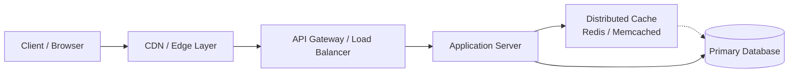

| Layer | Technologies | Target Data |
| :--- | :--- | :--- |
| **Client** | HTTP Cache Headers, LocalStorage | Static assets (JS, CSS, images), user preferences |
| **Edge / CDN** | Cloudflare, CloudFront, Akamai | Static files, geo-distributed cacheable API responses |
| **Gateway / Reverse Proxy** | Nginx, Envoy, Kong | Upstream HTTP response caching |
| **Application Layer** | Local memory (Guava, Caffeine) | Highly localized hot keys, configs |
| **Distributed Cache** | Redis, Memcached, Hazelcast | Shared session data, user profiles, aggregated queries |
| **Database Buffers** | MySQL InnoDB Pool, Postgres Shared Buffers | Raw table pages, index trees |

---

## 3. Read & Write Strategies

### 1. Cache-Aside (Lazy Loading)
The application code directly controls cache read/write/evict operations. Data is loaded into Redis only when requested on a cache miss.

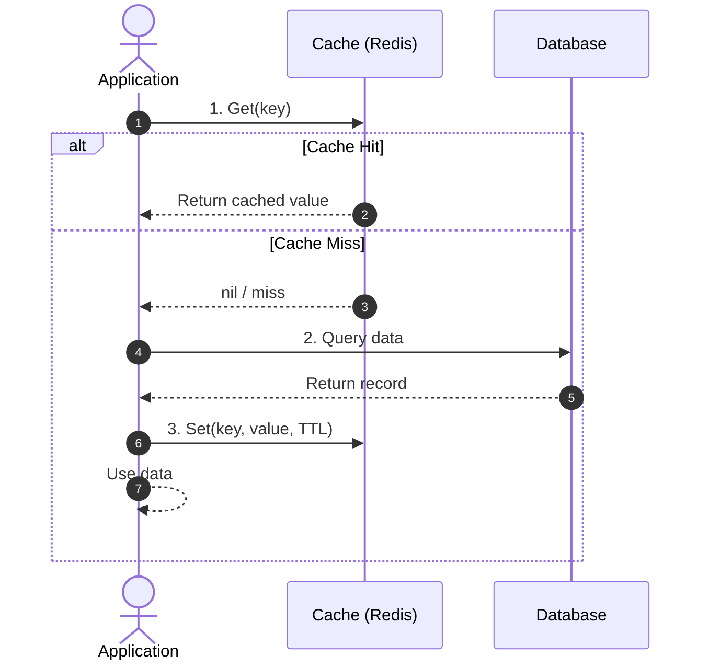

- **Java Source:** [`CacheAsideUserService.java`](src/main/java/com/example/caching/strategies/CacheAsideUserService.java)
- **Pros:** Memory-efficient (only requested keys are cached); resilient (system falls back to DB if Redis is down).
- **Cons:** Cache miss latency penalty (3 round trips); potential for stale data if database is updated without cache eviction.

---

### 2. Read-Through & Write-Through
The application interacts only with a cache abstraction. The cache is responsible for synchronizing with the database.

- **Read-Through:** On cache miss, the cache layer fetches from the DB transparently, stores it, and returns it.
- **Write-Through:** Every write synchronously persists to both Database and Redis before acknowledging success.

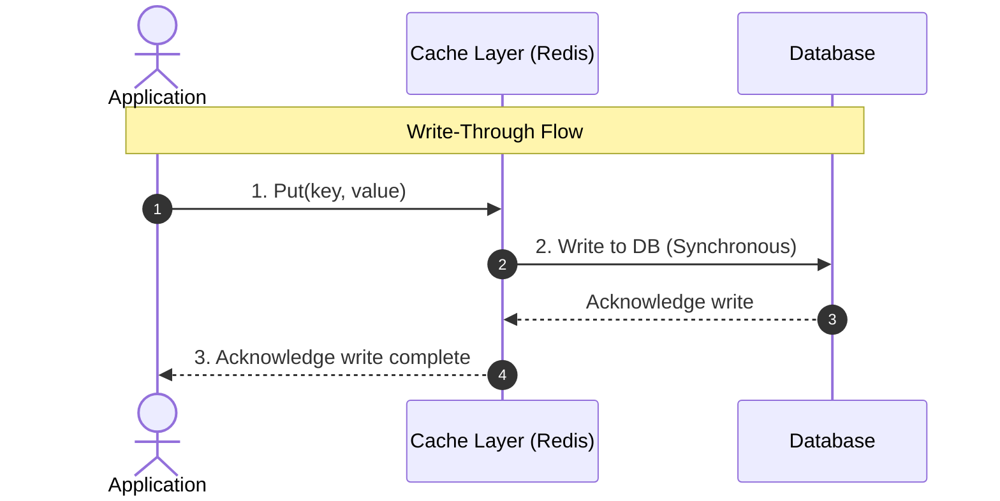

- **Java Source:** [`ReadAndWriteThroughCache.java`](src/main/java/com/example/caching/strategies/ReadAndWriteThroughCache.java)
- **Pros:** High data consistency; subsequent reads are guaranteed cache hits.
- **Cons:** Higher write latency due to dual synchronous writes.

---

### 3. Write-Behind (Write-Back)
Data is written immediately to the Redis cache and acknowledged to the caller. A background worker / queue asynchronously flushes batched writes to the database.

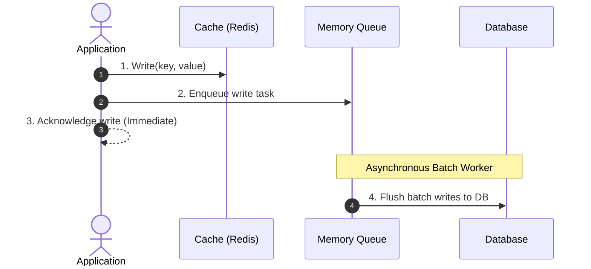

- **Java Source:** [`WriteBehindCache.java`](src/main/java/com/example/caching/strategies/WriteBehindCache.java)
- **Pros:** Ultra-low write latency; handles immense write traffic by batching database writes.
- **Cons:** Risk of permanent data loss if the cache/queue crashes before flushing to persistent storage.

---

### 4. Write-Around
Data is written directly to the database, completely bypassing the Redis cache. The cache is populated only when the data is subsequently read (via Cache-Aside).

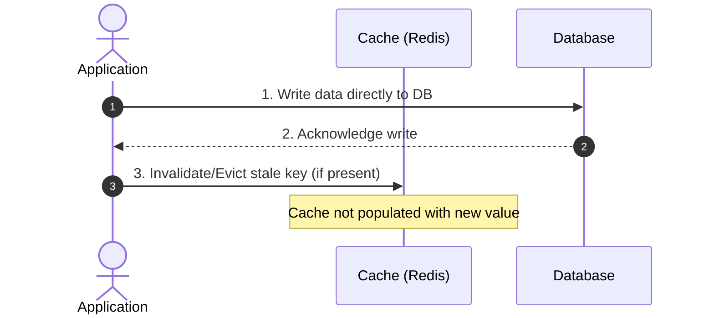

- **Java Source:** [`WriteAroundUserService.java`](src/main/java/com/example/caching/strategies/WriteAroundUserService.java)
- **Pros:** Prevents cache pollution for write-heavy data that is rarely read (e.g. audit logs, billing archives).
- **Cons:** The first read on recently written data will always result in a cache miss.

---

### 5. Refresh-Ahead (Read-Ahead)
The cache predicts hot item expiration. If a key is accessed when its remaining TTL is below a threshold (e.g., within 20% of expiration), an asynchronous background task proactively re-fetches fresh data from the database and extends the TTL in Redis before it ever expires.

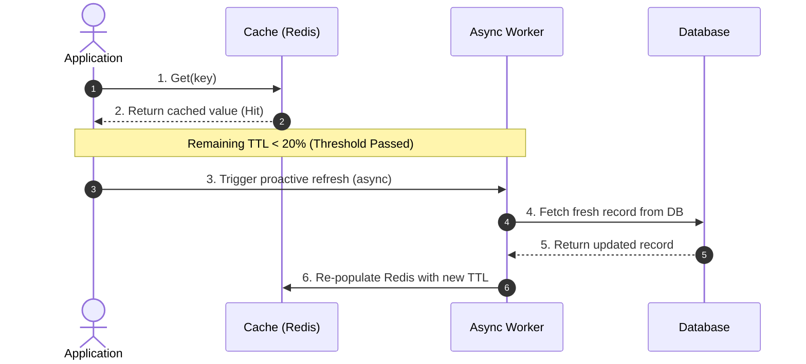

- **Java Source:** [`RefreshAheadCacheService.java`](src/main/java/com/example/caching/strategies/RefreshAheadCacheService.java)
- **Pros:** Completely eliminates cache-miss latency for hot keys; prevents Cache Stampedes / Thundering Herd problems.
- **Cons:** Inaccurate access predictions can cause unnecessary database load.

---

## 4. Cache Eviction Policies

| Policy | Mechanism | Best Use Case |
| :--- | :--- | :--- |
| **LRU (Least Recently Used)** | Discards items that have not been accessed for the longest time. | Standard read-heavy web applications. |
| **LFU (Least Frequently Used)** | Tracks access frequency; discards items with lowest access counts. | Workloads with stable long-term hot items. |
| **FIFO (First-In First-Out)** | Discards items in the exact order they were inserted. | Time-series, sequential, or append-only data. |
| **TTL (Time-to-Live)** | Automatically expires keys after a defined duration. | Volatile tokens, session data, rate-limit counters. |
| **Random Eviction** | Randomly evicts keys to reclaim memory. | Uniform access distributions. |

---

## 5. Distributed Failure Modes & Mitigation

| Failure Mode | Cause | Mitigation Strategy | Java Source |
| :--- | :--- | :--- | :--- |
| **Cache Stampede (Thundering Herd)** | Hot key expires under heavy concurrent load, causing massive DB spikes. | Mutex locking / Singleflight pattern; `Refresh-Ahead`; Probabilistic early expiration (XFetch). | [`CacheStampedeMitigation.java`](src/main/java/com/example/caching/failures/CacheStampedeMitigation.java) |
| **Cache Avalanche** | Large volume of keys expire simultaneously or entire cache cluster restarts. | Random TTL jitter (base ± range); Staggered warm-up on cold restart. | [`CacheAvalancheMitigation.java`](src/main/java/com/example/caching/failures/CacheAvalancheMitigation.java) |
| **Cache Penetration** | Repeated requests for non-existent keys bypass cache and hit DB directly. | Cache null/empty sentinel values with low TTL; Bloom Filter guard before lookups. | [`CachePenetrationMitigation.java`](src/main/java/com/example/caching/failures/CachePenetrationMitigation.java) |
| **Data Inconsistency (Stale Cache)** | DB updated but cache invalidation fails or out-of-order writes occur. | Change Data Capture (CDC via Debezium); Transactional Outbox pattern. | [`StaleDataMitigation.java`](src/main/java/com/example/caching/failures/StaleDataMitigation.java) |

### Failure Mode Details

#### Cache Stampede (Thundering Herd)
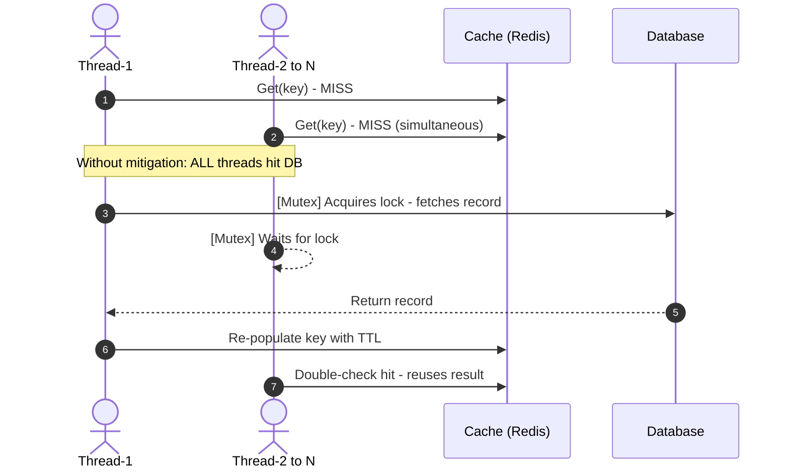
- **Mutex / Singleflight** — [`CacheStampedeMitigation.getUserWithMutex()`](src/main/java/com/example/caching/failures/CacheStampedeMitigation.java)
- **XFetch Probabilistic Early Expiration** — [`CacheStampedeMitigation.getUserWithXFetch()`](src/main/java/com/example/caching/failures/CacheStampedeMitigation.java)

#### Cache Avalanche
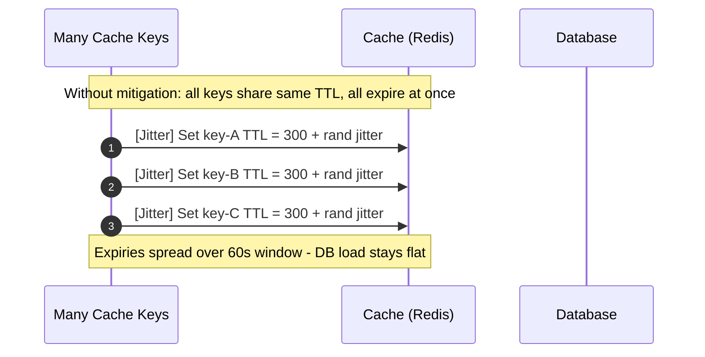
- **TTL Jitter** — [`CacheAvalancheMitigation.getUser()`](src/main/java/com/example/caching/failures/CacheAvalancheMitigation.java)
- **Staggered Warm-Up** — [`CacheAvalancheMitigation.staggeredWarmUp()`](src/main/java/com/example/caching/failures/CacheAvalancheMitigation.java)

#### Cache Penetration
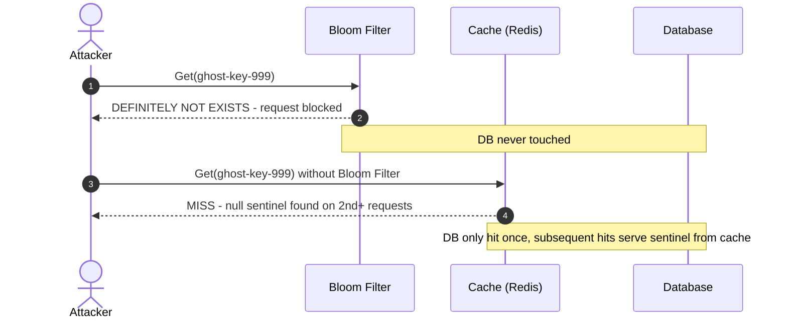
- **Null Sentinel Caching** — [`CachePenetrationMitigation.getUserWithNullCache()`](src/main/java/com/example/caching/failures/CachePenetrationMitigation.java)
- **Bloom Filter Guard** — [`CachePenetrationMitigation.getUserWithBloomFilter()`](src/main/java/com/example/caching/failures/CachePenetrationMitigation.java)

#### Data Inconsistency (Stale Cache)
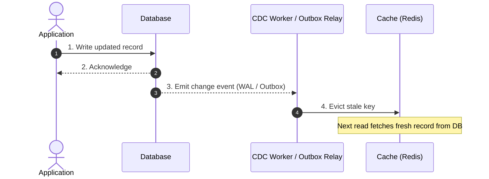
- **CDC Invalidation** — [`StaleDataMitigation.updateUserWithCdc()`](src/main/java/com/example/caching/failures/StaleDataMitigation.java)
- **Transactional Outbox** — [`StaleDataMitigation.updateUserWithOutbox()`](src/main/java/com/example/caching/failures/StaleDataMitigation.java)

---

## 6. Strategy Selection Matrix

| Strategy | Read Latency | Write Latency | Data Consistency | Best Fit For |
| :--- | :--- | :--- | :--- | :--- |
| **Cache-Aside** | Low (Hit) / High (Miss) | Fast (DB + Evict) | Eventual | General-purpose web apps |
| **Write-Through** | Ultra-Low | Higher (DB + Cache) | High | Financial/eCommerce product catalogs |
| **Write-Behind** | Ultra-Low | Ultra-Low | Eventual (Lag risk) | High-volume ingestion, telemetry, activity logs |
| **Write-Around** | High on 1st read | Fast | High in DB | Write-heavy, rarely-read records (audit trails) |
| **Refresh-Ahead** | Ultra-Low (Near 0 misses) | Normal | High | Ultra-hot keys (trending feeds, live leaderboards) |

---

## 7. Advanced Caching Patterns

### Multi-Level Cache (L1 + L2)
Combines a fast local in-process cache (L1) with Redis (L2). Hot keys are served from heap memory with zero network overhead; only L1 misses reach Redis.

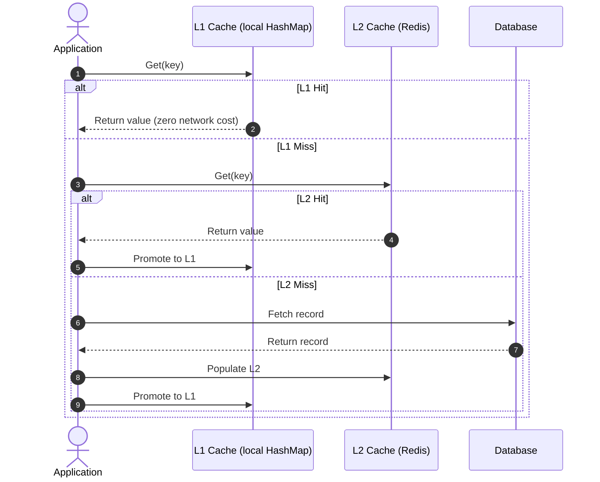

- **Java Source:** [`MultiLevelCache.java`](src/main/java/com/example/caching/patterns/MultiLevelCache.java)
- **Pros:** Near-zero latency for ultra-hot keys; Redis is bypassed entirely for L1 hits.
- **Cons:** L1 is per-instance, so multiple pods can serve slightly different values briefly after a write.

---

### Cache Warmer
Proactively loads known hot keys into Redis before live traffic is routed. Prevents the cold-start penalty after deploys or cache restarts.

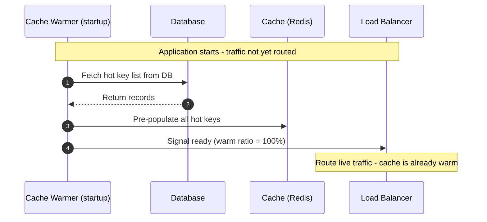

- **Java Source:** [`CacheWarmer.java`](src/main/java/com/example/caching/patterns/CacheWarmer.java)
- **Pros:** First real request always hits cache; eliminates cold-start DB spikes.
- **Cons:** Adds startup time; hot-key list must be maintained or derived from analytics.

---

### Segmented Cache
Prefixes every key with a namespace (`user:`, `product:`, `session:`) so different entity types share one Redis instance without collisions and can be flushed independently.

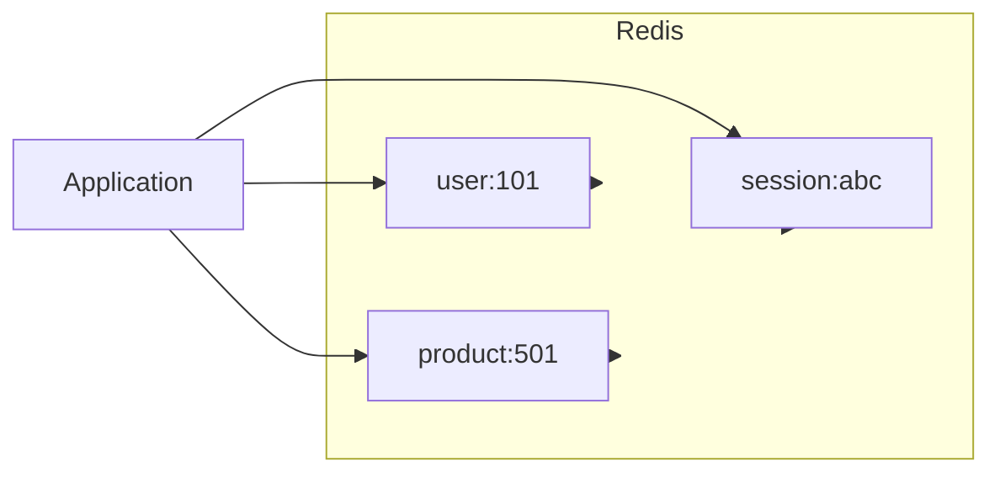

- **Java Source:** [`SegmentedCache.java`](src/main/java/com/example/caching/patterns/SegmentedCache.java)
- **Pros:** Zero key collision risk; per-segment TTL policies; selective flush without affecting other namespaces.
- **Cons:** Slightly longer key strings; namespace discipline must be enforced across the codebase.

---

## 8. Redis Utility Clients

### Distributed Lock
Implements mutual exclusion across multiple JVM instances using Redis `SET NX PX`. A unique token prevents accidental release by the wrong holder, and the TTL guarantees automatic expiry if the holder crashes.

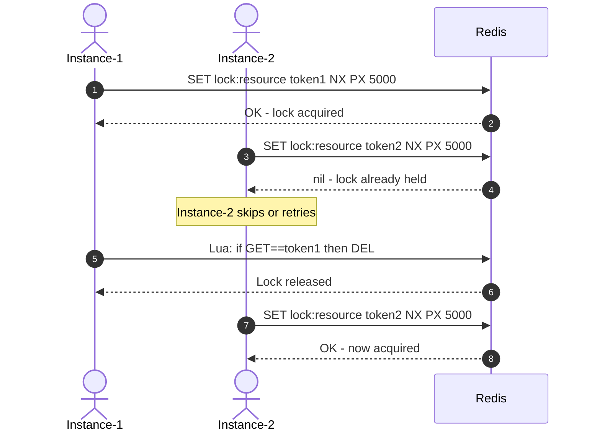

- **Java Source:** [`DistributedLockClient.java`](src/main/java/com/example/caching/cache/DistributedLockClient.java)
- **Pros:** Cross-JVM mutual exclusion; deadlock-safe via TTL; atomic Lua release prevents false unlocks.
- **Cons:** Single Redis node is a SPOF; use Redlock or Redisson for multi-node quorum in critical paths.

---

### Rate Limiter
Enforces per-client request quotas using Redis `INCR` + `EXPIRE`. Two strategies are implemented: Fixed Window (simple, minimal memory) and Sliding Window (weighted blend eliminates boundary bursts).

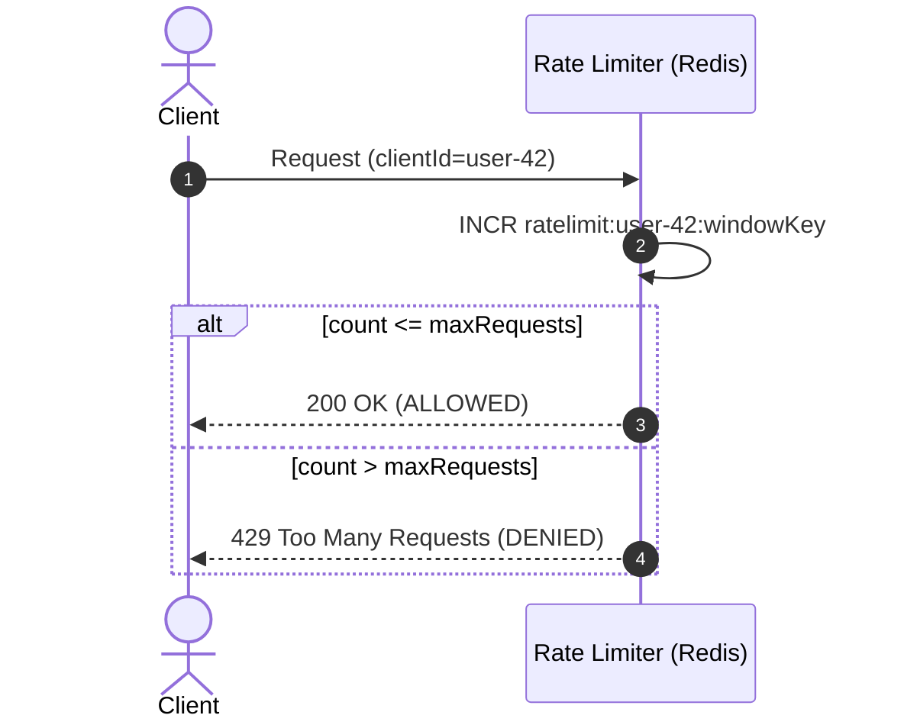

- **Java Source:** [`RateLimiterClient.java`](src/main/java/com/example/caching/cache/RateLimiterClient.java)
- **Fixed Window** — [`allowFixedWindow()`](src/main/java/com/example/caching/cache/RateLimiterClient.java): simple counter per time bucket.
- **Sliding Window** — [`allowSlidingWindow()`](src/main/java/com/example/caching/cache/RateLimiterClient.java): weighted blend of current + previous window to smooth boundary bursts.
- **Pros:** Distributed; works across all pods; atomic via Redis single-thread model.
- **Cons:** Fixed window allows 2x burst at boundaries (mitigated by sliding window variant).

---

## 9. Java + Redis Project Setup & Running

### Requirements
- Java 17+
- Maven 3.8+
- Redis Server running on `localhost:6379`

### Run with Docker:
```powershell
# 1. Start Redis
docker run -d -p 6379:6379 --name redis-caching-demo redis:alpine

# 2. Compile and run the Java demo
mvn compile exec:java -Dexec.mainClass="com.example.caching.Main"
```
